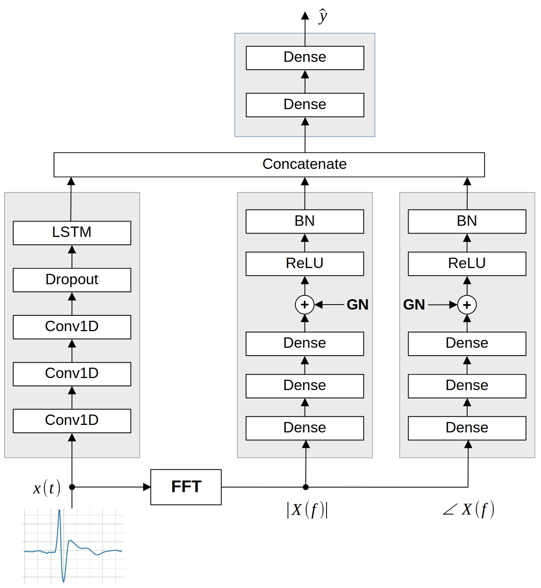

# Brugada-ECG-phase
Source code for the work presented in [1] regarding the identification of **Brugada syndrome** by exploiting ECG phase information.

Prompted by the importance of phase information in signal processing, the proposed approach is based on an architecture that fuses the ECG time signal, its FFT magnitude, and the corresponding phase information. Specifically, the proposed architecture, shown in the following figure, is composed of three parallel branches working on the time-domain signal, the FFT magnitude, and phase, respectively.

1. M. Scarpiniti and A. Uncini, "Exploiting phase information for the identification of Brugada syndrome: A preliminary study", in *Neural Networks: Overview of Current Theories and Applications* (A. Esposito, M. Faundez-Zanuy, F. C. Morabito, E. Pasero, G. Cordasco, Eds.), ISBN: 978-981-95-4071-6, Springer 2026. DOI: [https://doi.org/10.1007/978-981-95-4072-3_2](https://doi.org/10.1007/978-981-95-4072-3_2)
